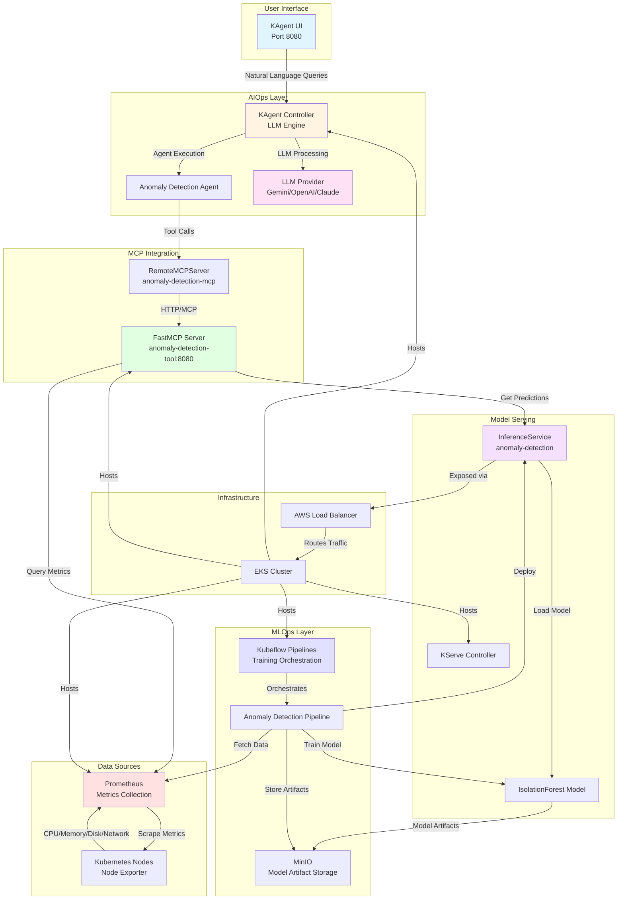

# AIOps + MLOps Platform

A comprehensive Proof of Concept (POC) platform that combines **MLOps** (Machine Learning Operations) and **AIOps** (Artificial Intelligence for IT Operations) to enable intelligent, LLM-powered interaction with Kubernetes infrastructure and ML models.

## Project Overview

This platform demonstrates an end-to-end solution for:
- **MLOps**: Automated ML model training, deployment, and serving using Kubeflow Pipelines and KServe
- **AIOps**: Natural language interface powered by LLMs (via KAgent) to query and interact with cluster metrics and ML models
- **Anomaly Detection**: Real-time anomaly detection in Kubernetes cluster metrics (CPU, memory, disk, network) using ML models

## What We Built

### 1. Infrastructure as Code (Terraform)
- **AWS EKS Cluster**: Managed Kubernetes cluster with auto-scaling node groups
- **VPC & Networking**: Multi-AZ VPC with public/private subnets
- **EKS Blueprints Addons**: 
  - AWS Load Balancer Controller
  - Cert Manager
  - Kube Prometheus Stack (monitoring & metrics collection)
  - Metrics Server
  - Cluster Autoscaler

### 2. MLOps Components

#### Kubeflow Pipelines
- **Automated ML Pipeline**: End-to-end pipeline for anomaly detection model training
  - **Data Collection**: Fetches CPU metrics from Prometheus
  - **Feature Engineering**: Creates rolling statistics, rate of change, time-based features
  - **Model Training**: Trains IsolationForest model for anomaly detection
  - **Model Deployment**: Automatically deploys trained model to KServe InferenceService
- **Artifact Storage**: MinIO for storing model artifacts and pipeline data

#### KServe (Model Serving)
- **InferenceService**: Serves trained ML models via REST API
- **Model Registry**: Stores model artifacts in S3-compatible storage (MinIO)
- **Auto-scaling**: Scales inference endpoints based on traffic

### 3. AIOps Components

#### KAgent (LLM-Powered Interface)
- **Natural Language Interface**: Users can query the system using natural language
- **Multiple LLM Providers**: Supports Gemini, OpenAI, Anthropic, Ollama
- **Built-in Agents**: 
  - `k8s-agent`: Kubernetes resource management
  - `kgateway-agent`: Gateway management
  - `promql-agent`: Prometheus query assistance
- **Custom Tools**: Integration with Grafana, query documentation

#### Anomaly Detection Tool (FastMCP Server)
- **Prometheus Integration**: Queries real-time cluster metrics
- **ML Model Integration**: Calls KServe InferenceService for predictions
- **Feature Engineering**: Matches training pipeline feature engineering
- **MCP Protocol**: Exposes tools via Model Context Protocol for LLM agents

### 4. Monitoring & Observability
- **Prometheus**: Metrics collection from cluster nodes and applications
- **Grafana**: Visualization dashboards
- **Service Monitors**: Automatic metric scraping for custom services

## Architecture Diagram



## Data Flow

### Training Flow (MLOps)
1. **Kubeflow Pipeline** is triggered (manually or scheduled)
2. **Fetch Data Component**: Queries Prometheus for historical CPU metrics
3. **Feature Engineering Component**: Creates features (rolling stats, rate of change, time features)
4. **Train Model Component**: Trains IsolationForest model on engineered features
5. **Deploy Component**: Creates/updates KServe InferenceService with trained model
6. **Model Artifact**: Stored in MinIO (S3-compatible storage)

### Inference Flow (AIOps)
1. **User** asks natural language question via KAgent UI (e.g., "Are there any anomalies in CPU usage?")
2. **KAgent** processes query using LLM (Gemini) to understand intent
3. **Anomaly Detection Agent** is invoked with appropriate tools
4. **FastMCP Server** receives tool call:
   - Queries Prometheus for recent metrics (last N hours)
   - Engineers features matching training pipeline
   - Calls KServe InferenceService for predictions
5. **KServe** loads model from MinIO and returns predictions
6. **Results** flow back through the chain, formatted by LLM into natural language response

## Key Components

### Directory Structure

```
aiops-mlops-platform/
├── terraform/              # Infrastructure as Code
│   ├── eks.tf             # EKS cluster configuration
│   ├── vpc.tf             # VPC and networking
│   ├── eks_blueprint.tf   # EKS Blueprints addons
│   └── variables.tf       # Configuration variables
│
├── kubeflow/              # Kubeflow setup
│   ├── pipeline-setup.sh # Kubeflow Pipelines installation
│   └── kserve-setup.sh   # KServe installation
│
├── ml-model/              # ML Pipeline
│   └── pipelines/
│       ├── pipeline.py    # Kubeflow Pipeline definition
│       ├── minio.yaml     # MinIO deployment
│       └── rbac.yaml      # Service accounts & RBAC
│
├── anomaly-detection/     # AIOps Integration
│   ├── tool/              # FastMCP Server implementation
│   │   ├── kagent_model_tool.py
│   │   └── Dockerfile
│   ├── model_tool.yaml    # FastMCP Server deployment
│   ├── mcpserver.yaml     # RemoteMCPServer CRD
│   └── agent.yaml         # KAgent Agent definition
│
├── kagent/                # KAgent Configuration
│   ├── setup.sh           # KAgent installation
│   └── helm-values.yaml   # Helm values for KAgent
│
└── llm-customization/     # LLM Model Customization
    ├── functiongemma_model.yaml  # Custom LLM deployment
    └── hf_secret.yaml     # HuggingFace token secret
```

## Setup Instructions

### Prerequisites
- AWS CLI configured
- Terraform >= 1.0
- kubectl
- Helm 3.x
- Docker (for building images)

### 1. Infrastructure Setup
```bash
cd terraform
terraform init
terraform plan
terraform apply
aws eks update-kubeconfig --region <region> --name <cluster-name>
```

### 2. Install Monitoring Stack
The Prometheus stack is installed via EKS Blueprints addons (see `terraform/eks_blueprint.tf`).

### 3. Setup Kubeflow Pipelines
```bash
cd kubeflow
./pipeline-setup.sh
# Access UI at http://localhost:8000 (port-forward)
```

### 4. Setup KServe
```bash
cd kubeflow
./kserve-setup.sh
```

### 5. Deploy ML Pipeline
```bash
cd ml-model/pipelines
./setup.sh
# Upload generated-anomaly-detection-pipeline.yaml to Kubeflow UI
```

### 6. Setup KAgent
```bash
cd kagent
export GEMINI_API_KEY="your-api-key"
./setup.sh
# Access UI at http://localhost:8080 (port-forward)
```

### 7. Deploy Anomaly Detection Tool
```bash
cd anomaly-detection
# Build and push Docker image
docker buildx build --platform linux/amd64 -t <registry>/anomaly-detection-tool:v2 ./tool
docker push <registry>/anomaly-detection-tool:v2

# Update model_tool.yaml with your image
# Update INFERENCE_SERVICE_URL and DEFAULT_INSTANCE_IP
kubectl apply -f model_tool.yaml
kubectl apply -f mcpserver.yaml
kubectl apply -f agent.yaml
```

## Usage Examples

### Natural Language Queries (via KAgent UI)
- "What will be the CPU usage next week?"
- "Are there any anomalies in cluster metrics?"
- "Show me predicted memory consumption for the last hour"
- "When should I scale up my deployment?"
- "Detect anomalies in CPU usage for instance 10.0.1.244:9100"

### Direct API Calls
```bash
# Query Prometheus and get predictions
curl -X POST http://anomaly-detection-tool.default.svc.cluster.local:8080/mcp \
  -H "Content-Type: application/json" \
  -d '{
    "method": "tools/call",
    "params": {
      "name": "predict_anomalies",
      "arguments": {
        "instance_ip": "10.0.1.244:9100",
        "hours": 1
      }
    }
  }'
```

## Technology Stack

- **Infrastructure**: AWS EKS, Terraform
- **ML Platform**: Kubeflow Pipelines, KServe
- **Model Serving**: KServe (v2 protocol)
- **ML Framework**: scikit-learn (IsolationForest)
- **AIOps**: KAgent, FastMCP, Model Context Protocol
- **LLM**: Gemini (default), OpenAI, Anthropic, Ollama
- **Monitoring**: Prometheus, Grafana
- **Storage**: MinIO (S3-compatible)
- **Container Runtime**: Docker, Kubernetes

## Key Features

✅ **End-to-End MLOps**: Automated training, deployment, and serving  
✅ **Natural Language Interface**: LLM-powered query system  
✅ **Real-time Anomaly Detection**: Prometheus + ML model integration  
✅ **Model Versioning**: Artifact storage and version management  
✅ **Auto-scaling**: Cluster and inference endpoint scaling  
✅ **Observability**: Comprehensive monitoring and metrics  

## Future Enhancements

- [ ] Support for additional metrics (memory, disk, network)
- [ ] Multi-model support (different models for different metrics)
- [ ] Automated retraining pipelines
- [ ] A/B testing for model deployments
- [ ] Alerting integration
- [ ] Cost optimization recommendations
- [ ] Multi-cluster support

## Troubleshooting

See component-specific troubleshooting guides:
- `kubeflow/TROUBLESHOOTING.md` (if exists)
- Check pod logs: `kubectl logs -n <namespace> <pod-name>`
- Verify services: `kubectl get svc -A`
- Check pipeline runs in Kubeflow UI

## License

This is a POC project for demonstration purposes.

