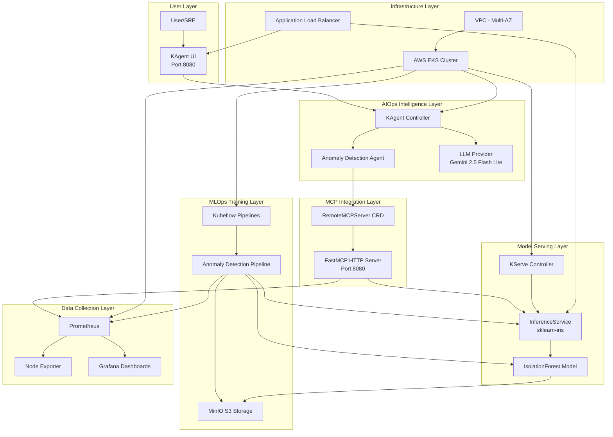
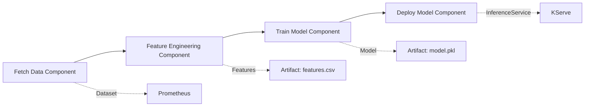
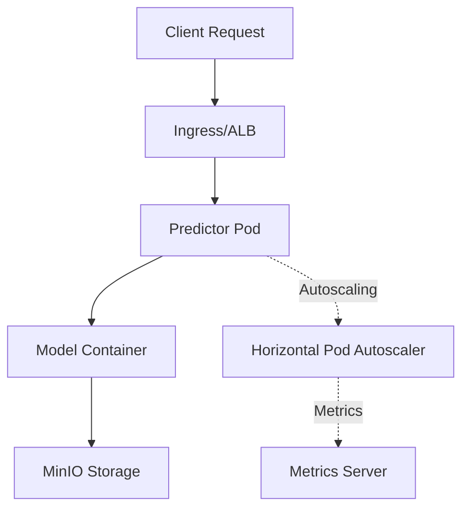
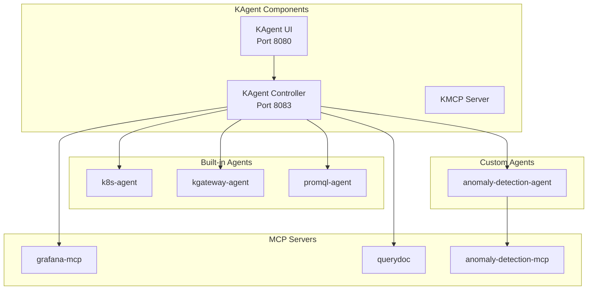
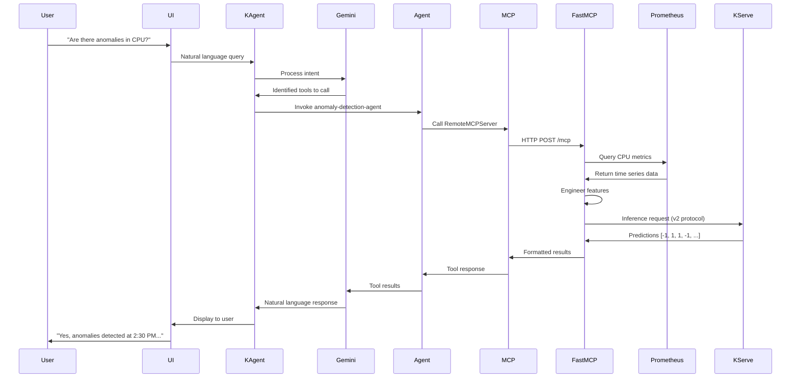
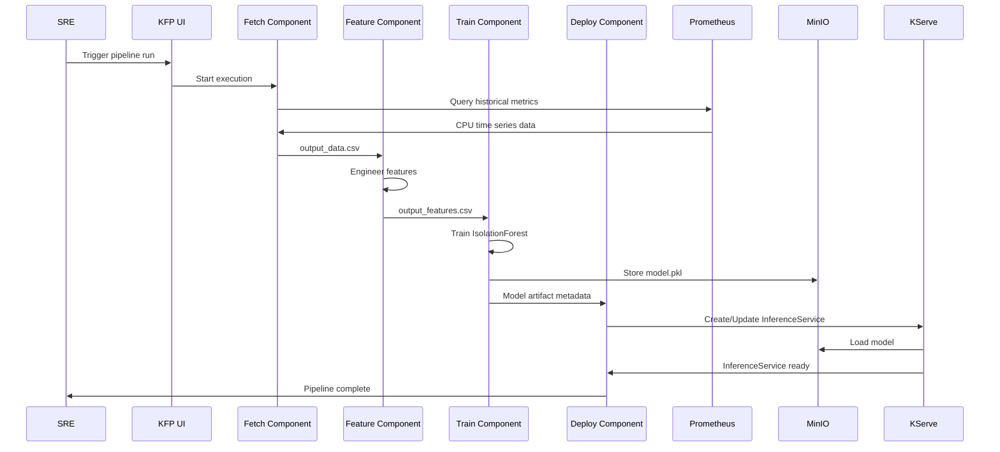
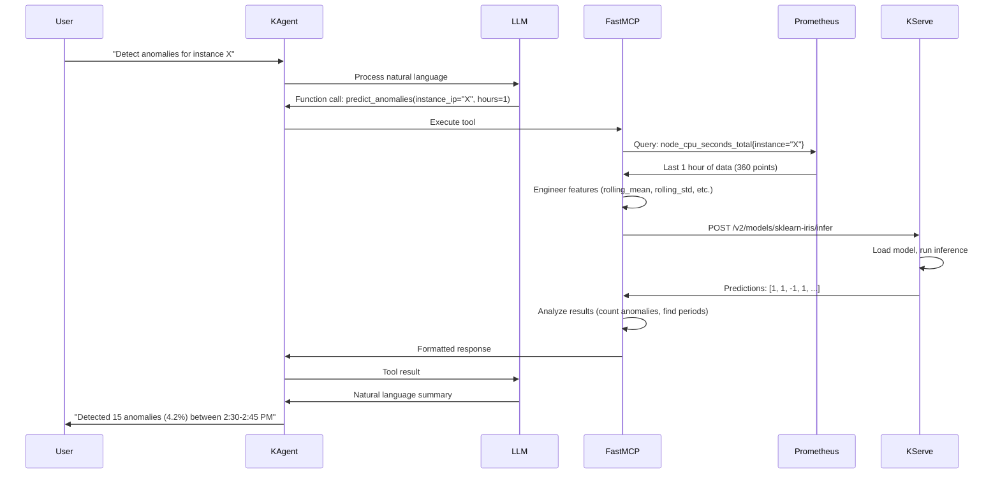

# AIOps + MLOps Platform - Technical Documentation

**Version:** 1.0  
**Last Updated:** January 2026  
**Author:** Chidambaram K  
**Purpose:** Technical deep-dive for engineering teams

---

## Table of Contents

1. [Executive Summary](#executive-summary)
2. [System Architecture](#system-architecture)
3. [Technology Stack Deep Dive](#technology-stack-deep-dive)
4. [MLOps Layer - Training Pipeline](#mlops-layer---training-pipeline)
5. [Model Serving Infrastructure](#model-serving-infrastructure)
6. [AIOps Layer - Intelligent Agent System](#aiops-layer---intelligent-agent-system)
7. [Data Flow & Integration Patterns](#data-flow--integration-patterns)
8. [Infrastructure as Code](#infrastructure-as-code)
9. [Observability & Monitoring](#observability--monitoring)
10. [Security & Access Control](#security--access-control)
11. [Deployment Guide](#deployment-guide)
12. [Troubleshooting & Best Practices](#troubleshooting--best-practices)

---

## Executive Summary

This platform demonstrates a production-grade integration of **MLOps** (Machine Learning Operations) and **AIOps** (Artificial Intelligence for IT Operations) to enable intelligent, natural language-driven interaction with Kubernetes infrastructure and ML-powered anomaly detection.

### Key Capabilities

- **Automated ML Pipeline**: End-to-end training orchestration using Kubeflow Pipelines
- **Real-time Anomaly Detection**: Isolation Forest algorithm trained on Prometheus metrics
- **Natural Language Interface**: LLM-powered agent system (KAgent) for conversational infrastructure management
- **Model Context Protocol (MCP)**: Standardized integration between LLMs and backend tools
- **Production Infrastructure**: AWS EKS with auto-scaling, load balancing, and comprehensive monitoring

---

## System Architecture

### High-Level Component Overview



### Component Layers

| Layer | Components | Purpose |
|-------|-----------|---------|
| **User Interface** | KAgent UI | Web-based natural language interface |
| **AIOps Intelligence** | KAgent Controller, Agents, LLM | Natural language processing and intent understanding |
| **MCP Integration** | RemoteMCPServer, FastMCP | Tool calling protocol between LLM and backend services |
| **MLOps Training** | Kubeflow Pipelines, MinIO | Automated model training and artifact storage |
| **Model Serving** | KServe, InferenceService | Real-time ML model inference |
| **Data Collection** | Prometheus, Node Exporter, Grafana | Metrics collection and visualization |
| **Infrastructure** | AWS EKS, ALB, VPC | Container orchestration and networking |

---

## Technology Stack Deep Dive

### Infrastructure & Orchestration

| Technology | Version | Purpose | Configuration |
|------------|---------|---------|---------------|
| **AWS EKS** | 1.31 | Managed Kubernetes cluster | Multi-AZ, auto-scaling node groups |
| **Terraform** | >= 1.0 | Infrastructure as Code | AWS provider, EKS Blueprints module |
| **VPC** | - | Network isolation | Public/private subnets across 3 AZs |
| **AWS Load Balancer Controller** | Latest | Ingress management | ALB for external access |
| **Cluster Autoscaler** | 9.29.0 | Node auto-scaling | Scales based on pod resource requests |

### MLOps Components

| Technology | Version | Purpose | Key Features |
|------------|---------|---------|--------------|
| **Kubeflow Pipelines** | 1.8.x | ML workflow orchestration | Declarative pipeline definitions, artifact tracking |
| **KServe** | 0.11.x | Model serving platform | Auto-scaling, multi-framework support, v2 protocol |
| **MinIO** | Latest | S3-compatible storage | Model artifact repository, pipeline data storage |
| **scikit-learn** | 1.8.0 | ML framework | IsolationForest algorithm implementation |
| **Python** | 3.13-slim | Pipeline runtime | Lightweight container base image |

### AIOps & Agent Framework

| Technology | Version | Purpose | Key Features |
|------------|---------|---------|--------------|
| **KAgent** | 0.2.2+ | Agent orchestration platform | Multi-agent support, built-in tools |
| **Gemini** | 2.5 Flash Lite | Large Language Model | Fast, cost-effective, function calling |
| **FastMCP** | Latest | MCP server implementation | HTTP transport, tool registration |
| **Model Context Protocol (MCP)** | - | LLM-tool integration standard | Standardized tool calling protocol |

### Monitoring & Observability

| Technology | Version | Purpose | Features |
|------------|---------|---------|----------|
| **Prometheus** | 48.2.3 (stack) | Metrics collection | Node Exporter, Service Monitors, PromQL |
| **Grafana** | (bundled) | Visualization | Pre-built dashboards, alerting |
| **Jaeger** | Latest | Distributed tracing | OpenTelemetry integration |
| **Metrics Server** | Latest | Resource metrics | HPA support, kubectl top |

---

## MLOps Layer - Training Pipeline

### Kubeflow Pipeline Architecture

The anomaly detection training pipeline is implemented as a **Kubeflow Pipeline v2** with four sequential components.

#### Pipeline Components



#### 1. Fetch Data Component

**Purpose:** Query Prometheus for historical CPU metrics

**Implementation:**
```python
@component(
    base_image='python:3.13-slim',
    packages_to_install=['pandas==2.3.3', 'prometheus-api-client==0.7.0']
)
def fetch_data_component(
    prometheus_url: str,
    training_hours: int,
    instance_ip: str,
    output_data: Output[Dataset]
):
    # Queries Prometheus for CPU usage metrics
    # Formula: 100 - (avg(rate(node_cpu_seconds_total{mode="idle"}[5m])) * 100)
```

**Key Parameters:**
- `prometheus_url`: Internal Prometheus service URL
- `training_hours`: Historical data window (typically 2-24 hours)
- `instance_ip`: Target node instance (e.g., `10.0.0.194:9100`)
- `step`: Query resolution (default: 10 seconds)

**Output:** CSV file with `timestamp` and `cpu_usage` columns

#### 2. Feature Engineering Component

**Purpose:** Transform raw metrics into ML-ready features

**Features Created:**

| Feature | Calculation | Purpose |
|---------|------------|---------|
| `cpu_usage` | Raw metric value | Primary signal |
| `rolling_mean` | 5-point moving average | Trend detection |
| `rolling_std` | 5-point standard deviation | Volatility measurement |
| `rate_of_change` | First-order difference | Spike detection |
| `hour` | Hour of day (0-23) | Temporal patterns |

**Implementation:**
```python
df['rolling_mean'] = df['cpu_usage'].rolling(window=5, min_periods=1).mean()
df['rolling_std'] = df['cpu_usage'].rolling(window=5, min_periods=1).std().fillna(0)
df['rate_of_change'] = df['cpu_usage'].diff().fillna(0)
df['hour'] = df['timestamp'].dt.hour
```

**Why These Features?**
- **Rolling statistics**: Capture short-term trends and volatility
- **Rate of change**: Detect sudden spikes or drops
- **Hour of day**: Capture daily patterns (e.g., business hours vs. off-hours)

#### 3. Train Model Component

**Purpose:** Train IsolationForest anomaly detection model

**Algorithm: Isolation Forest**

Isolation Forest is an unsupervised anomaly detection algorithm that works by:
1. Randomly selecting a feature and split value
2. Recursively partitioning the data
3. Anomalies are isolated faster (fewer splits) than normal points

**Model Configuration:**
```python
model = IsolationForest(
    contamination=0.05,      # Expected % of anomalies (5%)
    random_state=42,         # Reproducibility
    n_estimators=100         # Number of trees
)
```

**Parameters Explained:**
- `contamination`: Expected proportion of outliers (5% = 1 in 20 data points)
- `n_estimators`: More trees = better accuracy but slower training

**Prediction Output:**
- `1` = Normal sample
- `-1` = Anomaly

**Training Metrics:**
```json
{
  "training_samples": 2000,
  "normal_samples": 1900,
  "anomalies_detected": 100,
  "normal_percentage": 95.0,
  "anomalies_percentage": 5.0
}
```

#### 4. Deploy Model Component

**Purpose:** Deploy trained model as KServe InferenceService

**InferenceService Specification:**
```yaml
apiVersion: serving.kserve.io/v1beta1
kind: InferenceService
metadata:
  name: anomaly-detection
spec:
  predictor:
    serviceAccountName: sa-minio-kserve
    model:
      modelFormat:
        name: sklearn
      protocolVersion: v2
      runtime: kserve-sklearnserver
      storageUri: s3://mlpipeline/v2/artifacts/.../model.pkl
```

**Key Features:**
- **Automatic storage URI detection**: Reads from KFP artifact metadata
- **Service account**: `sa-minio-kserve` for MinIO access
- **Protocol v2**: KServe inference protocol
- **Update-or-create**: Patches existing InferenceService or creates new

### Pipeline Execution

**Trigger Methods:**
1. Manual (Kubeflow UI)
2. Scheduled (CronJob - not implemented yet)
3. Event-driven (Prometheus alerts - not implemented yet)

**Execution Flow:**
```
User uploads pipeline YAML → KFP creates pods → Components run sequentially → 
Model artifacts stored in MinIO → InferenceService deployed → Ready for inference
```

**Typical Runtime:** 5-10 minutes (depending on training_hours parameter)

---

## Model Serving Infrastructure

### KServe Architecture

KServe provides **serverless inference** for ML models with built-in:
- Auto-scaling (scale to zero)
- Multi-framework support (TensorFlow, PyTorch, scikit-learn, XGBoost)
- Canary deployments
- Traffic splitting

### InferenceService Components



### Model Loading Process

1. **Pod startup**: KServe creates predictor pod
2. **Storage initialization**: Mounts S3-compatible storage using service account credentials
3. **Model download**: Fetches `model.pkl` from MinIO
4. **Model deserialization**: Loads scikit-learn model using `pickle`
5. **Health checks**: Readiness and liveness probes
6. **Ready to serve**: Accepts inference requests

### Inference Endpoint

**Internal URL:**
```
http://sklearn-iris.default.svc.cluster.local/v2/models/sklearn-iris/infer
```

**External URL (via ALB):**
```
http://<alb-dns>/v2/models/sklearn-iris/infer
```

### KServe v2 Inference Protocol

**Request Format:**
```json
{
  "inputs": [
    {
      "name": "input-0",
      "shape": [1, 5],
      "datatype": "FP64",
      "data": [[75.5, 73.2, 1.8, 0.5, 14]]
    }
  ]
}
```

**Input Features (in order):**
1. `cpu_usage`: Current CPU usage percentage
2. `rolling_mean`: 5-point moving average
3. `rolling_std`: 5-point standard deviation
4. `rate_of_change`: First-order difference
5. `hour`: Hour of day (0-23)

**Response Format:**
```json
{
  "model_name": "sklearn-iris",
  "outputs": [
    {
      "name": "output-0",
      "shape": [1],
      "datatype": "INT64",
      "data": [-1]
    }
  ]
}
```

**Prediction Interpretation:**
- `-1` = Anomaly detected
- `1` = Normal behavior

### Auto-scaling Configuration

**Default Settings:**
- **Min replicas**: 1
- **Max replicas**: 5 (can be configured)
- **Target concurrency**: 100 requests per pod
- **Scale-to-zero**: Enabled (after 60s idle)

---

## AIOps Layer - Intelligent Agent System

### KAgent Framework

KAgent is a **Kubernetes-native agent orchestration platform** that enables:
- Declarative agent definitions (CRD-based)
- Multi-LLM provider support
- Built-in Kubernetes integration
- Model Context Protocol (MCP) support

### Architecture Components



### Custom Anomaly Detection Agent

**Agent Definition (CRD):**
```yaml
apiVersion: kagent.dev/v1alpha2
kind: Agent
metadata:
  name: anomaly-detection-agent
  namespace: kagent
spec:
  type: Declarative
  description: "Detects anomalies in cluster metrics using ML models"
  declarative:
    modelConfig: custom-model-config
    systemMessage: |
      You are an AI agent specialized in detecting anomalies in 
      Kubernetes cluster metrics. Use available tools to query 
      Prometheus and run anomaly detection predictions.
    tools:
    - mcpServer:
        apiGroup: kagent.dev
        kind: RemoteMCPServer
        name: anomaly-detection-mcp
        toolNames:
        - predict_anomalies
        - query_prometheus_and_predict
```

**Key Features:**
- **Declarative**: Defined via Kubernetes CRD
- **Scoped tools**: Only has access to anomaly detection tools
- **Custom system prompt**: Specialized for SRE tasks

### FastMCP Server Implementation

The anomaly detection tool is implemented as a **FastMCP HTTP server** running in a Kubernetes pod.

**Server Structure:**
```python
# Initialize FastMCP
mcp = FastMCP("Anomaly Detection Model")

# Tool 1: Predict Anomalies
@mcp.tool()
def predict_anomalies(instance_ip: str, hours: int) -> str:
    # 1. Query Prometheus
    # 2. Engineer features
    # 3. Call KServe InferenceService
    # 4. Format results
    return formatted_results

# Tool 2: Query and Predict
@mcp.tool()
def query_prometheus_and_predict(instance_ip: str, time_range_hours: int) -> str:
    # Similar to predict_anomalies but with different output format
    return formatted_results

# Run HTTP server
if __name__ == "__main__":
    mcp.run(transport="http")  # Listens on port 8080
```

**Environment Variables:**
```bash
PROMETHEUS_URL=http://kube-prometheus-stack-prometheus...svc.cluster.local:9090
INFERENCE_SERVICE_URL=http://sklearn-iris.default.svc.cluster.local
MODEL_NAME=sklearn-iris
DEFAULT_INSTANCE_IP=10.0.1.10:9100
FASTMCP_TRANSPORT=http
```

### RemoteMCPServer CRD

**Connects KAgent to FastMCP HTTP server:**
```yaml
apiVersion: kagent.dev/v1alpha1
kind: RemoteMCPServer
metadata:
  name: anomaly-detection-mcp
  namespace: kagent
spec:
  url: http://anomaly-detection-tool.default.svc.cluster.local:8080/mcp
```

### Tool Execution Flow



### LLM Provider Configuration

**Gemini (Default):**
```yaml
providers:
  default: gemini
  gemini:
    provider: Gemini
    model: "gemini-2.5-flash-lite"
    apiKeySecretRef: kagent-gemini
    apiKeySecretKey: GOOGLE_API_KEY
```

**Why Gemini 2.5 Flash Lite?**
- Fast response times (< 1s)
- Cost-effective
- Strong function calling capabilities
- Good reasoning for technical queries

**Alternative Providers Supported:**
- OpenAI (GPT-4, GPT-3.5)
- Anthropic (Claude)
- Ollama (self-hosted models)
- Azure OpenAI

---

## Data Flow & Integration Patterns

### Training Flow (MLOps)



**Timing:**
1. Data fetch: ~30s (for 2 hours of data)
2. Feature engineering: ~10s
3. Model training: ~1-2 minutes
4. Model deployment: ~2-3 minutes (K8s pod startup)

**Total: 5-10 minutes**

### Inference Flow (AIOps)



**Timing:**
1. LLM processing: ~500ms
2. Prometheus query: ~200ms
3. Feature engineering: ~100ms
4. KServe inference: ~300ms
5. LLM formatting: ~500ms

**Total: ~1.6 seconds**

### Feature Engineering Consistency

> **CRITICAL:** Feature engineering MUST be identical in training and inference

**Training (`pipeline.py`):**
```python
df['rolling_mean'] = df['cpu_usage'].rolling(window=5, min_periods=1).mean()
df['rolling_std'] = df['cpu_usage'].rolling(window=5, min_periods=1).std().fillna(0)
df['rate_of_change'] = df['cpu_usage'].diff().fillna(0)
df['hour'] = df['timestamp'].dt.hour
```

**Inference (`kagent_model_tool.py`):**
```python
df['rolling_mean'] = df['cpu_usage'].rolling(window=5, min_periods=1).mean()
df['rolling_std'] = df['cpu_usage'].rolling(window=5, min_periods=1).std().fillna(0)
df['rate_of_change'] = df['cpu_usage'].diff().fillna(0)
df['hour'] = df['timestamp'].dt.hour
```

**Any mismatch will cause prediction errors!**

---

## Infrastructure as Code

### Terraform Modules

**Project Structure:**
```
terraform/
├── main.tf              # Provider configuration
├── vpc.tf               # VPC with 3 AZs, public/private subnets
├── eks.tf               # EKS cluster, managed node groups
├── eks_blueprint.tf     # Monitoring stack, load balancers
├── variables.tf         # Input variables
├── outputs.tf           # Output values
├── terraform.tfvars     # Environment-specific values
└── helm/
    └── prometheus.yaml  # Prometheus Helm values
```

### VPC Configuration

**CIDR:** `10.0.0.0/16`

**Subnets:**
- **Public subnets**: 3 (one per AZ) - `10.0.1.0/24`, `10.0.2.0/24`, `10.0.3.0/24`
- **Private subnets**: 3 (one per AZ) - `10.0.101.0/24`, `10.0.102.0/24`, `10.0.103.0/24`

**Internet Access:**
- Public subnets: Internet Gateway
- Private subnets: NAT Gateway (one per AZ for high availability)

### EKS Cluster Configuration

**Control Plane:**
- Kubernetes version: 1.31
- Endpoint: Public + Private
- Networking: VPC CNI

**Managed Node Groups:**
```hcl
managed_node_groups = {
  general = {
    desired_size = 2
    min_size     = 1
    max_size     = 5
    instance_types = ["t3.medium"]  # 2 vCPU, 4 GB RAM
    capacity_type = "ON_DEMAND"
  }
}
```

**Auto-scaling Strategy:**
- Cluster Autoscaler monitors pod pending status
- Scales up when pods can't be scheduled
- Scales down when nodes are underutilized (< 50% for 10 minutes)

### EKS Blueprints Addons

**Installed via Terraform:**

| Addon | Purpose | Namespace |
|-------|---------|-----------|
| AWS Load Balancer Controller | Manages ALB/NLB | kube-system |
| Cert Manager | TLS certificate management | cert-manager |
| Metrics Server | Resource metrics API | kube-system |
| Kube Prometheus Stack | Monitoring | kube-prometheus-stack |
| Cluster Autoscaler | Node auto-scaling | kube-system |

**Prometheus Stack Components:**
- Prometheus Operator
- Prometheus server
- Alertmanager
- Grafana
- Node Exporter (DaemonSet on all nodes)
- kube-state-metrics

---

## Observability & Monitoring

### Prometheus Metrics Collection

**Node Exporter Metrics:**
- `node_cpu_seconds_total`: CPU time per mode (idle, user, system, etc.)
- `node_memory_MemAvailable_bytes`: Available memory
- `node_disk_io_time_seconds_total`: Disk I/O time
- `node_network_receive_bytes_total`: Network RX bytes

**PromQL Query for CPU Usage:**
```promql
100 - (avg(rate(node_cpu_seconds_total{mode="idle", instance="10.0.1.244:9100"}[5m])) * 100)
```

**Explanation:**
- `node_cpu_seconds_total{mode="idle"}`: CPU seconds in idle mode
- `rate(...[5m])`: Per-second rate over 5 minutes
- `avg(...)`: Average across all CPUs
- `100 - (... * 100)`: Convert to CPU usage percentage

### Service Monitors

**Automatic discovery of services to scrape:**
```yaml
apiVersion: monitoring.coreos.com/v1
kind: ServiceMonitor
metadata:
  name: kserve-inference
spec:
  selector:
    matchLabels:
      serving.kserve.io/inferenceservice: anomaly-detection
  endpoints:
  - port: http
    interval: 30s
```

### Grafana Dashboards

**Pre-installed dashboards:**
- Kubernetes cluster metrics
- Node Exporter metrics
- Persistent volume usage
- Workload performance

**Access:**
```bash
kubectl port-forward -n kube-prometheus-stack svc/kube-prometheus-stack-grafana 3000:80
# Default credentials: admin / prom-operator
```

### Distributed Tracing with Jaeger

**OpenTelemetry Integration:**
```yaml
otel:
  tracing:
    enabled: true
    exporter:
      otlp:
        endpoint: http://jaeger-collector.jaeger.svc.cluster.local:4317
```

**Traced Components:**
- KAgent controller
- Agent executions
- MCP tool calls
- LLM requests

**Access Jaeger UI:**
```bash
kubectl port-forward -n jaeger svc/jaeger-query 16686:16686
```

---

## Security & Access Control

### RBAC (Role-Based Access Control)

**MinIO Access (for KServe):**
```yaml
apiVersion: v1
kind: ServiceAccount
metadata:
  name: sa-minio-kserve
  namespace: default
---
apiVersion: v1
kind: Secret
metadata:
  name: sa-minio-kserve
  annotations:
    serving.kserve.io/s3-endpoint: minio-service.kubeflow:9000
    serving.kserve.io/s3-usehttps: "0"
type: Opaque
stringData:
  awsAccessKeyID: minioadmin
  awsSecretAccessKey: minioadmin
```

**KAgent Agent Permissions:**
- Agents can only call tools defined in their `spec.tools`
- Each agent has isolated execution environment
- Built-in agents have Kubernetes RBAC for resource access

### Network Policies (Recommended)

**Example: Isolate MinIO:**
```yaml
apiVersion: networking.k8s.io/v1
kind: NetworkPolicy
metadata:
  name: minio-access
spec:
  podSelector:
    matchLabels:
      app: minio
  ingress:
  - from:
    - podSelector:
        matchLabels:
          component: kserve-predictor
    - podSelector:
        matchLabels:
          pipeline.kubeflow.org/enabled: "true"
```

### Secrets Management

**Current Implementation:**
- Kubernetes Secrets for API keys
- Environment variables for non-sensitive config

**Production Recommendations:**
- AWS Secrets Manager integration
- External Secrets Operator
- Vault for secret rotation

---

## Deployment Guide

### Prerequisites

**Local Tools:**
```bash
# AWS CLI
aws --version  # >= 2.0

# Terraform
terraform --version  # >= 1.0

# kubectl
kubectl version --client  # >= 1.31

# Helm
helm version  # >= 3.0

# Docker (for building images)
docker --version  # >= 20.10
```

**AWS Permissions:**
- EKS cluster creation
- VPC management
- IAM role creation
- EC2 instance management

### Step 1: Infrastructure Deployment

```bash
cd terraform

# Initialize Terraform
terraform init

# Review planned changes
terraform plan

# Apply infrastructure
terraform apply

# Update kubeconfig
aws eks update-kubeconfig --region us-west-2 --name aiops-mlops-cluster

# Verify cluster access
kubectl get nodes
```

**Expected output:**
```
NAME                          STATUS   ROLES    AGE   VERSION
ip-10-0-1-xxx.ec2.internal    Ready    <none>   5m    v1.31.0
ip-10-0-2-xxx.ec2.internal    Ready    <none>   5m    v1.31.0
```

### Step 2: Verify Monitoring Stack

```bash
# Check Prometheus deployment
kubectl get pods -n kube-prometheus-stack

# Expected pods:
# - alertmanager-0
# - prometheus-0
# - kube-prometheus-stack-operator-xxx
# - kube-prometheus-stack-grafana-xxx
# - node-exporter-xxx (one per node)

# Port-forward Prometheus
kubectl port-forward -n kube-prometheus-stack svc/kube-prometheus-stack-prometheus 9090:9090

# Open http://localhost:9090 and verify targets are UP
```

### Step 3: Install Kubeflow Pipelines

```bash
cd kubeflow

# Install Kubeflow Pipelines
./pipeline-setup.sh

# Wait for deployment
kubectl wait --for=condition=ready pod -l app=ml-pipeline -n kubeflow --timeout=300s

# Port-forward UI
kubectl port-forward -n kubeflow svc/ml-pipeline-ui 8000:80

# Access at http://localhost:8000
```

### Step 4: Install KServe

```bash
cd kubeflow

# Install KServe
./kserve-setup.sh

# Verify installation
kubectl get pods -n kserve
kubectl get crd | grep serving.kserve.io
```

### Step 5: Deploy ML Pipeline

```bash
cd ml-model/pipelines

# Install prerequisites (MinIO, RBAC)
kubectl apply -f minio.yaml
kubectl apply -f rbac.yaml

# Wait for MinIO to be ready
kubectl wait --for=condition=ready pod -l app=minio -n kubeflow --timeout=300s

# Compile pipeline
python3 pipeline.py

# Generated file: generated-anomaly-detection-pipeline.yaml
# Upload to Kubeflow UI at http://localhost:8000
```

**In Kubeflow UI:**
1. Click "Pipelines" → "Upload Pipeline"
2. Select `generated-anomaly-detection-pipeline.yaml`
3. Click "Create Run"
4. Set parameters:
   - `prometheus_url`: `http://kube-prometheus-stack-prometheus.kube-prometheus-stack.svc.cluster.local:9090`
   - `training_hours`: `2`
   - `instance_ip`: Get from `kubectl get nodes -o wide` (use INTERNAL-IP + `:9100`)
5. Click "Start"

**Monitor execution:**
- Watch pod logs in Kubeflow UI
- Check MinIO for artifacts: `kubectl port-forward -n kubeflow svc/minio-service 9001:9001`
- Verify InferenceService: `kubectl get inferenceservice`

### Step 6: Install KAgent

```bash
cd kagent

# Create secret for Gemini API key
export GEMINI_API_KEY="your-api-key-here"

# Install KAgent
./setup.sh

# Verify deployment
kubectl get pods -n kagent

# Expected pods:
# - kagent-controller-xxx
# - kagent-ui-xxx
# - kagent-tools-xxx
```

### Step 7: Deploy Anomaly Detection Tool

```bash
cd anomaly-detection

# Build Docker image
docker buildx build --platform linux/amd64 -t <your-registry>/anomaly-detection-tool:v2 ./tool

# Push to registry
docker push <your-registry>/anomaly-detection-tool:v2

# Update model_tool.yaml with your image
# Update INFERENCE_SERVICE_URL and DEFAULT_INSTANCE_IP

# Deploy FastMCP server
kubectl apply -f model_tool.yaml

# Wait for deployment
kubectl wait --for=condition=ready pod -l app=anomaly-detection-tool --timeout=300s

# Deploy RemoteMCPServer
kubectl apply -f mcpserver.yaml

# Deploy Agent
kubectl apply -f agent.yaml

# Verify
kubectl get remotemcpserver -n kagent
kubectl get agent -n kagent
```

### Step 8: Access KAgent UI

```bash
# Port-forward UI
kubectl port-forward -n kagent svc/kagent-ui 8080:8080

# Open http://localhost:8080
```

**Test queries:**
- "What agents are available?"
- "Are there any anomalies in CPU usage?"
- "Predict anomalies for instance 10.0.1.244:9100 for the last 2 hours"

---

## Troubleshooting & Best Practices

### Common Issues

#### 1. Pipeline Fails at Data Fetch

**Symptoms:**
```
Error: No data returned from Prometheus
```

**Debugging:**
```bash
# Check Prometheus is accessible
kubectl port-forward -n kube-prometheus-stack svc/kube-prometheus-stack-prometheus 9090:9090

# Test query manually in Prometheus UI
# Query: node_cpu_seconds_total{instance="10.0.1.244:9100"}

# Check if Node Exporter is running
kubectl get pods -n kube-prometheus-stack | grep node-exporter

# Verify instance IP
kubectl get nodes -o wide
```

**Solution:**
- Ensure `instance_ip` matches INTERNAL-IP from `kubectl get nodes -o wide`
- Add `:9100` port suffix
- Verify Node Exporter is running on all nodes

#### 2. InferenceService Not Ready

**Symptoms:**
```bash
kubectl get inferenceservice
# NAME                READY   PREV   LATEST
# anomaly-detection   False
```

**Debugging:**
```bash
# Check predictor pod logs
kubectl get pods | grep anomaly-detection
kubectl logs <predictor-pod-name>

# Common errors:
# - MinIO connection failed
# - Model file not found
# - Invalid storage URI
```

**Solutions:**
- Verify MinIO is running: `kubectl get pods -n kubeflow | grep minio`
- Check service account: `kubectl get sa sa-minio-kserve`
- Verify storage URI in InferenceService spec
- Check MinIO bucket: Port-forward MinIO UI and browse to `mlpipeline/v2/artifacts`

#### 3. FastMCP Server Connection Issues

**Symptoms:**
```
Agent execution failed: Connection refused to RemoteMCPServer
```

**Debugging:**
```bash
# Check pod status
kubectl get pods -l app=anomaly-detection-tool

# Check logs
kubectl logs -l app=anomaly-detection-tool

# Test HTTP endpoint
kubectl port-forward svc/anomaly-detection-tool 8080:8080
curl http://localhost:8080/mcp -X POST -H "Content-Type: application/json" \
  -d '{"method": "tools/list"}'
```

**Solutions:**
- Ensure FastMCP server is running
- Verify environment variables (PROMETHEUS_URL, INFERENCE_SERVICE_URL)
- Check RemoteMCPServer URL matches service name

#### 4. Feature Engineering Mismatch

**Symptoms:**
- Model returns unexpected predictions
- All samples classified as anomalies or all as normal

**Debugging:**
```python
# In pipeline.py (training)
print(df[feature_columns].describe())

# In kagent_model_tool.py (inference)
print(df_features[feature_columns].describe())

# Compare statistics - they should be similar for similar data
```

**Solutions:**
- Ensure rolling window size is identical (5)
- Verify fillna(0) is applied consistently
- Check timestamp parsing is identical

### Best Practices

#### ML Pipeline

1. **Training data quality:**
   - Use at least 24 hours of data for training
   - Ensure data covers normal and anomalous periods
   - Avoid training during known incidents

2. **Model versioning:**
   - Tag pipeline runs with version numbers
   - Store model metadata (training params, metrics)
   - Keep track of which model is deployed

3. **Retraining schedule:**
   - Retrain weekly to adapt to changing patterns
   - Trigger retraining after major infrastructure changes
   - Monitor model drift using validation metrics

#### Anomaly Detection

1. **Contamination parameter:**
   - Start with 0.05 (5% anomalies)
   - Adjust based on actual anomaly rate
   - Too low = missed anomalies, too high = false positives

2. **Time windows:**
   - For real-time monitoring: 1 hour
   - For historical analysis: 24 hours
   - For trend detection: 7 days

3. **Interpretation:**
   - Single anomaly = possible spike, monitor
   - Multiple consecutive anomalies = issue requiring attention
   - Periodic anomalies = normal pattern (e.g., batch jobs)

#### KAgent Usage

1. **Natural language queries:**
   - Be specific: "Detect anomalies in CPU for instance X" vs. "Check CPU"
   - Specify time ranges: "last 2 hours" vs. "recently"
   - Follow up questions work: "Show me more details"

2. **Agent selection:**
   - Use `anomaly-detection-agent` for ML-based predictions
   - Use `promql-agent` for direct Prometheus queries
   - Use `k8s-agent` for cluster management

#### Resource Management

1. **Node sizing:**
   - t3.medium minimum for general workloads
   - t3.large+ for Kubeflow pipeline components
   - Consider GPU nodes for deep learning models (future)

2. **Cost optimization:**
   - Use Spot instances for non-critical workloads
   - Enable scale-to-zero for InferenceServices
   - Clean up old pipeline runs (artifacts consume storage)

3. **Capacity planning:**
   - Monitor node CPU/memory usage
   - Set resource requests/limits for all pods
   - Use HPA for stateless services

---

## Future Enhancements

### Planned Features

1. **Multi-metric support:**
   - Memory anomaly detection
   - Disk I/O anomaly detection
   - Network traffic anomaly detection
   - Combined model for all metrics

2. **Advanced ML:**
   - LSTM for time series forecasting
   - AutoML for model selection
   - Online learning for model updates

3. **Alerting integration:**
   - Prometheus alerts triggered by anomalies
   - PagerDuty/Slack notifications
   - Auto-remediation playbooks

4. **Model governance:**
   - A/B testing for model deployments
   - Model performance tracking
   - Automated rollback on degradation

5. **Multi-cluster support:**
   - Federated Prometheus
   - Cross-cluster anomaly correlation
   - Centralized KAgent instance

### Research Areas

- **Explainable AI**: Why was this classified as anomaly?
- **Causal inference**: What caused the anomaly?
- **Predictive auto-scaling**: Scale before anomaly occurs
- **Anomaly clustering**: Group related anomalies together

---

## Appendix

### Key URLs

| Service | URL | Access Method |
|---------|-----|---------------|
| Kubeflow Pipelines | http://localhost:8000 | `kubectl port-forward -n kubeflow svc/ml-pipeline-ui 8000:80` |
| KAgent UI | http://localhost:8080 | `kubectl port-forward -n kagent svc/kagent-ui 8080:8080` |
| Prometheus | http://localhost:9090 | `kubectl port-forward -n kube-prometheus-stack svc/kube-prometheus-stack-prometheus 9090:9090` |
| Grafana | http://localhost:3000 | `kubectl port-forward -n kube-prometheus-stack svc/kube-prometheus-stack-grafana 3000:80` |
| MinIO UI | http://localhost:9001 | `kubectl port-forward -n kubeflow svc/minio-service 9001:9001` |
| Jaeger UI | http://localhost:16686 | `kubectl port-forward -n jaeger svc/jaeger-query 16686:16686` |

### Namespace Map

| Namespace | Components |
|-----------|------------|
| `default` | InferenceService, FastMCP server |
| `kubeflow` | Kubeflow Pipelines, MinIO |
| `kserve` | KServe controller |
| `kagent` | KAgent controller, UI, agents, MCP servers |
| `kube-prometheus-stack` | Prometheus, Grafana, Node Exporter |
| `kube-system` | AWS Load Balancer Controller, Cluster Autoscaler |
| `jaeger` | Jaeger collector, query service |

### Metrics Reference

**CPU Usage:**
```promql
100 - (avg(rate(node_cpu_seconds_total{mode="idle"}[5m])) * 100)
```

**Memory Usage:**
```promql
(1 - (node_memory_MemAvailable_bytes / node_memory_MemTotal_bytes)) * 100
```

**Disk Usage:**
```promql
(node_filesystem_size_bytes - node_filesystem_avail_bytes) / node_filesystem_size_bytes * 100
```

**Network RX Rate:**
```promql
rate(node_network_receive_bytes_total[5m])
```

### Document History

| Version | Date | Author | Changes |
|---------|------|--------|---------|
| 1.0 | Jan 2026 | Chidambaram K | Initial documentation |

---

**Questions or feedback?** Please reach out to the platform team.
